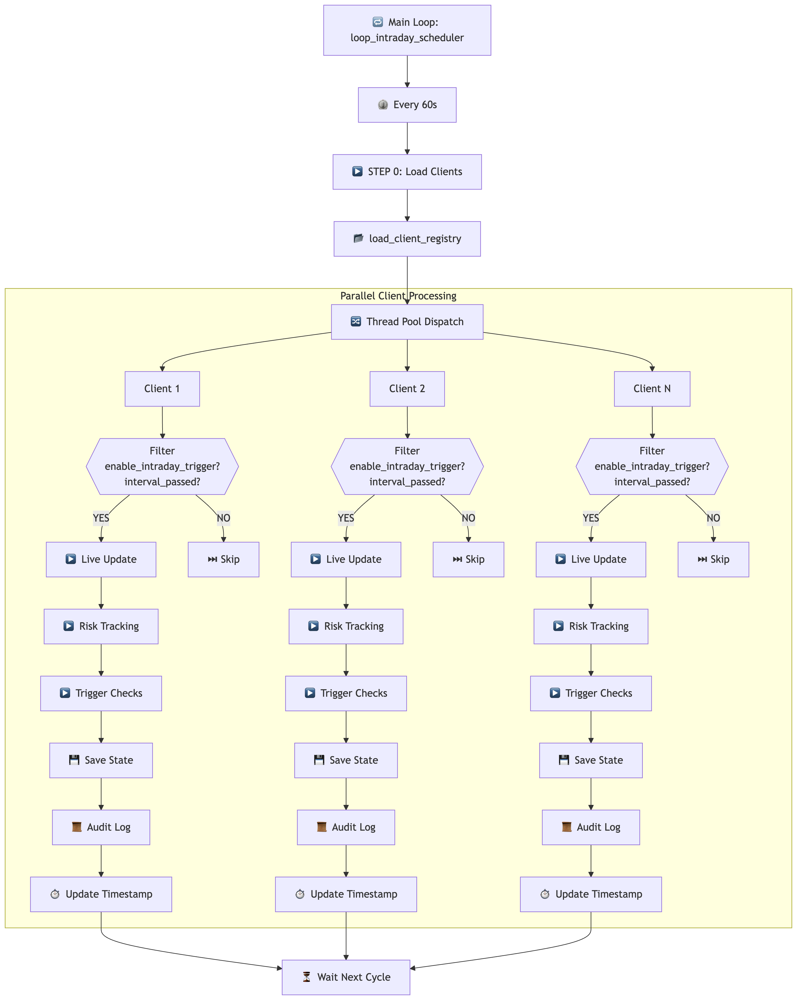
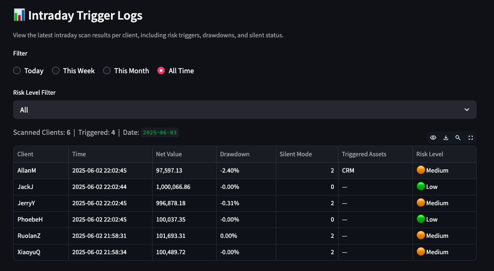

# `risk_engine/triggers/` — Real-Time & End-of-Day Risk Enforcement

This module powers XQRiskCore’s **dual-stage enforcement system**, designed to detect and respond to both **real-time market events** and **post-trade anomalies**.

By combining **intraday enforcement** with **overnight review**, it ensures that risks are addressed proactively — not just detected after the fact.

---

## 🚦 Enforcement Timing & Logic

| Engine                     | Execution Window     | Primary Purpose                                 | Enforcement Style     |
|----------------------------|----------------------|--------------------------------------------------|------------------------|
| 🛰️ `IntradayTriggerEngine` | Market hours         | Live risk enforcement (e.g. crash, slippage)     | 🔴 Immediate block     |
| 🌙 `SilentTriggerEngine`   | After market close   | EOD policy checks (e.g. cooldown, behavior flags) | 🟡 Overnight lockdown  |

This layered design enables **round-the-clock protection**, combining fast reaction to breaches with structured cooldown logic after hours.

---

## ⏱️ Intraday Enforcement Logic

Real-time checks during market hours continuously evaluate:

- 🔻 **Account- and asset-level drawdowns**  
- ⚠️ **Abnormal slippage or volatility spikes**  
- 🚫 **Exposure breaches or rapid behavioral deterioration**

⚡ If any configured threshold is triggered, the trade is **blocked instantly** and recorded for audit.

- 👉 [**Login as `admin` (Role: Admin)**](https://xqriskcore-production.up.railway.app)  
  → Go to **`Admin: Intraday Trigger Rules`** to configure per-client scanning frequency — balancing performance and risk sensitivity.
⬇️ Example: Client-specific intraday risk settings  

- 👉 [**Login as `risker` (Role: Risk Officer)**](https://xqriskcore-production.up.railway.app)  
  → Go to **`Risker: Trigger Scan History`**  
  → View timestamped intraday and end-of-day (EOD) trigger logs for full traceability.
⬇️ Example: Recorded scan activity and enforcement actions  

---

## 🌙 End-of-Day (EOD) Scan & Lockdown

At market close, `SilentTriggerEngine` runs a full scan across:

- 📉 **Execution slippage** — deviation from expected fill  
- 🧊 **Cooldown triggers** — e.g. consecutive trade failures  
- 🔁 **Behavioral anomalies** — e.g. overtrading, misaligned strategies

Accounts or assets breaching EOD policies are placed in **lockdown**, preventing further trades until reviewed or automatically released.

---

## 🧯 Manual Controls & Overrides

In addition to automated enforcement, **XQRiskCore** provides manual safeguards — allowing risk officers to proactively activate **Kill Switches** and **Silent Modes** when necessary.

- 👉 [**Login as `risker` (Role: Risk Officer)**](https://xqriskcore-production.up.railway.app)  
  → Go to **`Risker: Runtime Safeguards`**  
  → Manually enforce account- or asset-level trading restrictions in real time.

⬇️ **Account-Level Manual Controls**  
Freeze all trading for a specific account with a single click:  

⬇️ **Asset-Level Manual Controls**  
Individually toggle Silent Mode or Kill Switch for any asset:  

---

## 🔐 Strategic Purpose

This enforcement architecture is central to XQRiskCore’s **institutional-grade risk perimeter**, enabling:

- ✅ **Immediate market responsiveness**  
- ✅ **Overnight behavioral and slippage review**  
- ✅ **Seamless integration of automation and human oversight**  

It ensures that no trade bypasses oversight — regardless of timing, source, or system condition.
