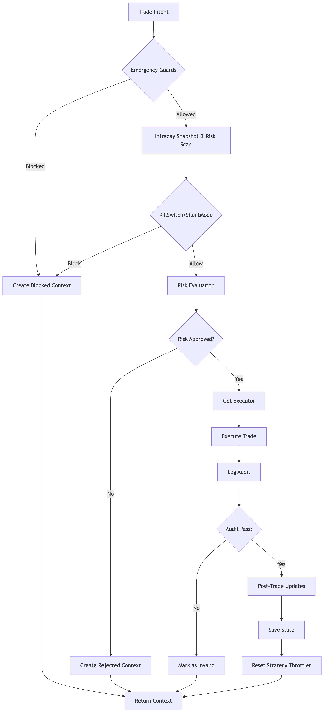

## 🛡️ Emergency Guard Layer

This layer enforces **system stability**, **audit completeness**, and **strategy discipline** — even under degraded or adversarial conditions.

Unlike traditional risk models that operate only on price-based triggers,  
the Emergency Guard Layer ensures that **structural safeguards** are embedded across all execution paths.

---

### ✅ Active Modules

| Module                | Function                                                             | Status       |
|-----------------------|----------------------------------------------------------------------|--------------|
| `SystemGuard`         | Blocks trade flow if critical services (market data / brokers) fail  | ✅ Active     |
| `StrategyThrottler`   | Rate-limits automated strategies to prevent overload or runaway logic | ✅ Active     |
| `TradeAuditFailSafe`  | Cancels trades if audit logs cannot be persisted post-execution      | ✅ Active     |
| `KillSwitchManager`   | Enforces manual or automated asset/account-level trade blocks        | ✅ Active     |
| `runtime_controls.py` | Provides UI-accessible kill switch & lockout overrides               | ✅ Active     |

---

### 🔁 Execution Hooks

| Hook Phase     | Guard Module(s) Applied                 |
|----------------|------------------------------------------|
| **Pre-trade**  | `SystemGuard`, `StrategyThrottler`       |
| **Post-trade** | `TradeAuditFailSafe`                     |
| **Override**   | `KillSwitchManager` (via UI or API call) |

These hooks **intercept the trade lifecycle** before and after critical stages,  
ensuring that **broken audit chains**, **strategy abuse**, or **infrastructure failure**  
do not result in ghost trades or untraceable outcomes.

---

### 🧬 Full Trade Lifecycle (with Guard Layer)

With the Emergency Guard Layer active, every trade follows a stricter, more auditable pipeline:

---

### 🧠 Why It Matters

> **Most systems break silently.**  
> This layer ensures that when they do — we either stop safely or leave an audit trace.

- ✅ No trade proceeds if upstream data fails.
- ✅ No execution is accepted if audit logs are broken.
- ✅ No strategy can overwhelm the system, even by accident.
- ✅ No manual override escapes the system’s visibility.

---

### 🧾 Future Enhancements (Planned)

- 🔄 **Resilience Circuit Breaker**: Detect + auto-reset modules under recovery
- 🕵️‍♂️ **Guard Breach Alerting**: Realtime UI + email warning if any guard is bypassed
- 🔒 **Privileged Override Logging**: Require 2FA + reason entry for emergency manual unblock

This layer is the **institutional insurance policy** inside XQRiskCore —  
designed to protect against edge cases, human error, and systemic drift.

